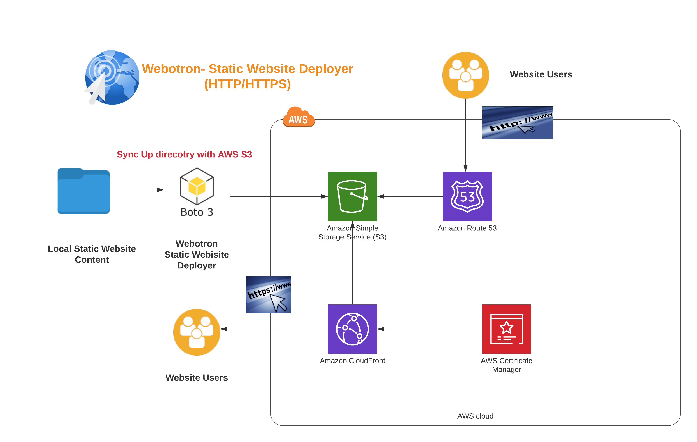

# Automating AWS with Python
Repository for the A Cloud Guru course *Automating AWS with Python*

## 01-webotron

Webotron is a script that will sync a local directory to an s3 bucket, and optionally configure Route 53 and cloudfront as well.

## Features

Webotron currently has the following features:

- List bucket
- List contents of a bucket
- Create and set up bucket
- Sync directory tree to bucket
- Set AWS profile with --profile=<profile_name>
- Configure route 53 domain
- Configure Cloud Front distribution with SSL

##Installation
pip install webotron-20

##Using webotron-20

  - Setup AWS profile. .AWS/config

  - Use profile to use/access AWS resources.

  - PS C:\Users\Rishu> webotron
    Usage: webotron [OPTIONS] COMMAND [ARGS]...

      Webotron deploys websites to AWS.

    Options:
      --profile TEXT  Use a given AWS profile.
      --help          Show this message and exit.

    Commands:
      find-cert            Find a certificate for given domain.
      list-bucket-objects  List objects in s3 bucket.
      list-buckets         List all s3 buckets.
      setup-bucket         Create and configure s3 bucket for Static Website...
      setup-cdn            To Setup a cloud frot for given domain and bucket.
      setup-domain         Configure DOMAIN to point to BUCKET.
      sync                 Sync contents from Path to Bucket.
    - Examples
        PS C:\Users\Rishu> webotron --profile=pythonAutomation list-buckets
        s3.Bucket(name='kittentest.techenvision.net')
        PS C:\Users\Rishu> webotron --profile=pythonAutomation list-bucket-objects kittentest.techenvision.net
        s3.ObjectSummary(bucket_name='kittentest.techenvision.net', key='css/main.css')
        s3.ObjectSummary(bucket_name='kittentest.techenvision.net', key='images/Balinese-kitten1.jpg')
        s3.ObjectSummary(bucket_name='kittentest.techenvision.net', key='images/Maine_coon_kitten_roarie.jpg')
        s3.ObjectSummary(bucket_name='kittentest.techenvision.net', key='images/SFSPCA_Kitten.jpg')
        s3.ObjectSummary(bucket_name='kittentest.techenvision.net', key='index.html')

        PS C:\Users\Rishu> webotron --profile=pythonAutomation sync "D:\Tech\Automate AWS with Python\code\automating-aws-with-python\01-webotron\kitten_web" kittentest.techenvision.net
        File has been successfully added : css/main.css
        File has been successfully added : images/Balinese-kitten1.jpg
        File has been successfully added : images/Maine_coon_kitten_roarie.jpg
        File has been successfully added : images/SFSPCA_Kitten.jpg
        File has been successfully added : index.html
        File has been successfully deleted : webotron.py
        File has been successfully deleted : certificate.py
        File has been successfully deleted : cdn.py
        File has been successfully deleted : domain.py
        File has been successfully deleted : __init__.py
        File has been successfully deleted : util.py
        File has been successfully deleted : bucket.py
        Sync is successful. Your bucket URL is:
        http://kittentest.techenvision.net.s3-website.us-east-2.amazonaws.com

        PS C:\Users\Rishu> webotron --profile=pythonAutomation find-cert kittentest.techenvision.net
        {'CertificateArn': 'arn:aws:acm:us-east-1:637555073356:certificate/56b961ea-f789-42a1-97fa-8328ccaa4a77', 'DomainName': 'techenvision.net'}

        PS C:\Users\Rishu> webotron --profile=pythonAutomation setup-cdn kittentest.techenvision.net kittentest.techenvision.net
        Distribution already exists. Creating Alias Record.
        Domain configured: https://kittentest.techenvision.net
        PS C:\Users\Rishu>
