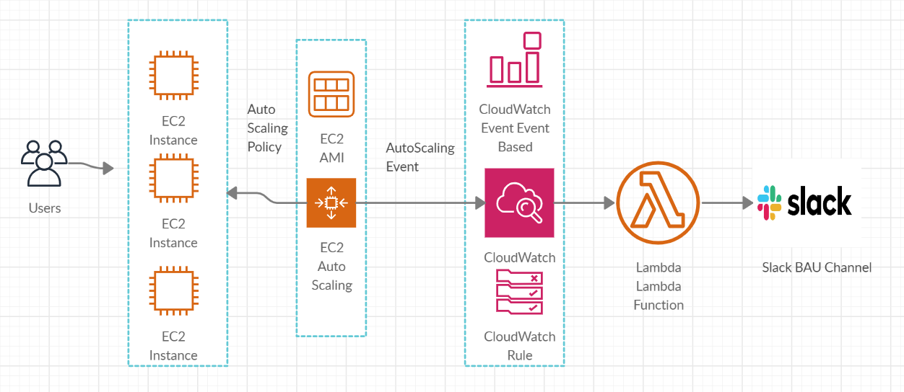
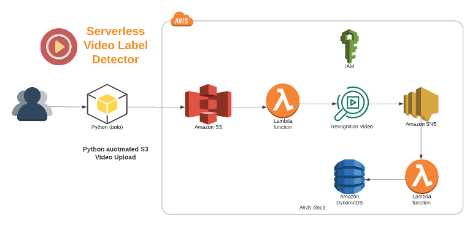

# Automating AWS with Python
Repository for the A Cloud Guru course *Automating AWS with Python*

## 01-webotron

Webotron is a script that will sync a local directory to an s3 bucket, and optionally configure Route 53 and cloudfront as well.

## Features

Webotron currently has the following features:

- List bucket
- List contents of a bucket
- Create and set up bucket
- Sync directory tree to bucket
- Set AWS profile with --profile=<profile_name>
- Configure route 53 domain
- Configure Cloud Front distribution with SSL

## 02-notifon

Notifon is a project to notify Slack users of changes to your AWS account using CloudWatch Events

### Features

Notifon currently has the following features:
- Send Notification to Slack from Lambda when auto scale happen.

## 03-videolyzer
Videolyzer is a project to perform video label detection on uploaded video in S3 and save response into DynamoDB using
Lambda Serverless.
Videolyzer currently has the following features:
- Upload Video to S3 bucket.
- Trigger event from S3 to Lambda Function to start Video Processing.
- Use SNS to identify completion of Label Detection Job and save into DynamoDB.

